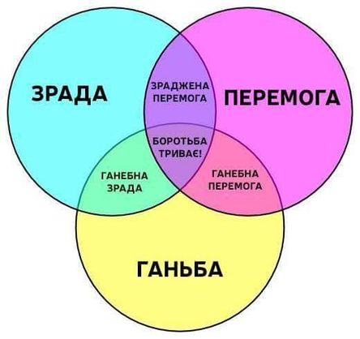
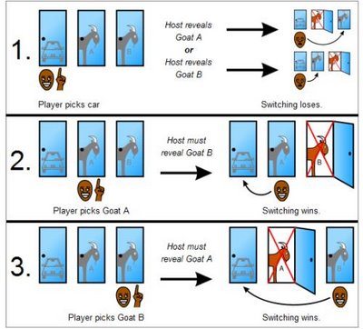

# Занятие 1 - Базовый инструментарий

## Алгоритм

Что такое алгоритм? Это последовательность однозначных шагов для решения какой-то проблемы.

Ключевые слова:

- проблема
- последовательность
- однозначность

Основные качества алгоритмов:

- Корректность
- Эффективность

Алгоритмическое мышление


## Примеры алгоритмов

- LZW
- FFT
- RSA
- PageRank


## Булева алгебра

16 бинарных операций, таких как `AND` и `OR`.

Таблицы истинности

### Правила Де Моргана

```
(not (and x y)) = (or (not x) (not y))

(not (or x y)) = (and (not x) (not y))
```


## Машинная арифметика

Машинное слова, двоичная арифметика


## Множества

Операции над множествами

Диаграммы Венна




## Парадокс Монти Холла



[Формулировка](https://ru.wikipedia.org/wiki/%D0%9F%D0%B0%D1%80%D0%B0%D0%B4%D0%BE%D0%BA%D1%81_%D0%9C%D0%BE%D0%BD%D1%82%D0%B8_%D0%A5%D0%BE%D0%BB%D0%BB%D0%B0)

```
(defun monty-hall (n)
  (let ((succ 0.0)
        (fail 0.0))
    (dotimes (i n)
      (let ((choice (random 3)) 
            (prize (random 3)))
        (if (= choice prize)
            (incf fail)
            (incf succ))))
    (/ succ fail)))
```


## To read/watch

- https://www.ted.com/talks/kevin_slavin_how_algorithms_shape_our_world
- http://informat.name/art/art_algmind.pdf
- http://stackoverflow.com/questions/1494950/improve-algorithmic-thinking
- https://archive.google.com/pigeonrank/
- http://io9.gizmodo.com/the-10-algorithms-that-dominate-our-world-1580110464?utm_source=nextdraft&utm_medium=email
