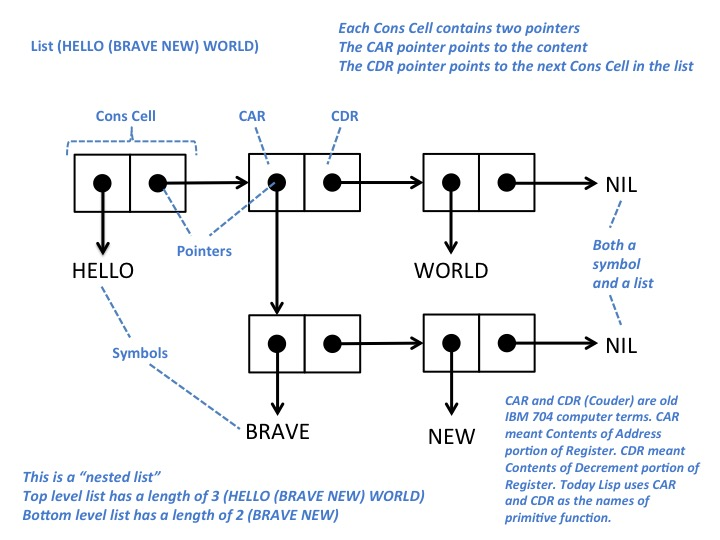

# Занятие 7 - Связные списки



## Виды списков

- Конс-пара
- Однонаправленный
- Двунаправленный


## Операции

Список — это функциональная структура данных, если использовать недеструктивные операции

Но также есть и деструктивные операции, которые меняют содержимое списка на месте

```
;; пример функциональной операции
(defun reverse (list)
  (let ((rez (list)))
    (dolist (item list)
      (push item rez))
    rez))

;; пример деструктивной операции
(defun nshuffle (list)
  (dotimes (i (length list))
     (rotatef (elt list i)
              (elt list (+ i (random (- end i))))))
  list)
```

По базовым операциям сравнение с массивом — в основном, не в пользу связного списка, в первую очередь из-за нелокальности памяти

Самые эффективные операции: `push` и `pop`

Со списками, как, впрочем, и с любыми последовтаельностями часто применяются функции высших порядков, такие как `map, flat-map, reduce, find(-if(-not)), remove(-if(-not)), keep(-if(-not)), subst(-if(-not))`, которые работают с последовтельностью, а также элементом или предикатом, по которому нужно искать элемент.


## Использование для реализации абстрактных структур данных

### Кортеж

Примитивный вариант кортежа, который хорош тем, что его просто создать (не требует дополнительных определений структуры кортежа), поэтому может работать как throw-away решение

### Стопка

Операции `push` и `pop`

Алгоритм: стопка с минимумом 

### Очередь

Одно- и двунаправленная

Алгоритм: реализация очереди (одно- и двунаправленной) с помощью 2-х стопок

### Множество

Это простейший способ представления множества. Но если список используется как множество, то высока стоимость операции проверки принадлежности `member` — `O(n)`, а также всех операций (объединение, пересечение, разница, ...) — `O(m * n)`. Однако, если список отсортирован, то множественные операции становятся эффективными — `O(m + n)`.

### Ключ-значение

В целом, не самое эффективное решшение, но когда количество пар мало (< 10) эффективно за счет того, что структуры с более быстрым доступом (хеш-таблицы, деревья) требуют больше накладных расходов

- plist: `(k1 v1 k2 v2 ...)`

- alist: `((k1 v1) (k2 v2) ...)`

- dlist: `((k1 k2 ...) v1 v2 ...)`

### Деревья (позже)

Список `(a (b (c d e f) (g h)) k)` представляет дерево:

```
        a
     /     \
     b      k
  /     \
  c      g
/ | \    |
d e f    h
```

## См. также

- Skip list
- самоорганизующийся список
- XOR-список


## To read

- http://cslibrary.stanford.edu/103/LinkedListBasics.pdf
- https://habrahabr.ru/post/262943/
- http://eli.thegreenplace.net/2011/09/06/stack-frame-layout-on-x86-64/
