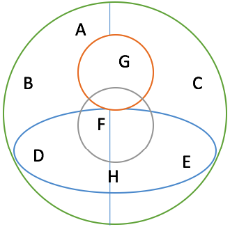

Множество всех слов (A), всех слов, которые заканчиваются на 'а' (B), всех существительных (C), всех имен собственных (D)

Множество всех цисел (A), всех целых чисел (B), всех рациональных чисел (C), всех иррациональных чисел (D) и всех натуральных чисел (E)

Множество всех людей (A), всех женщин (B), всех мужчин (C), всех девочек (D), всех мальчиков (E), всех сирот (F), всех людей, состоящих в браке (G), всех детей (H)

