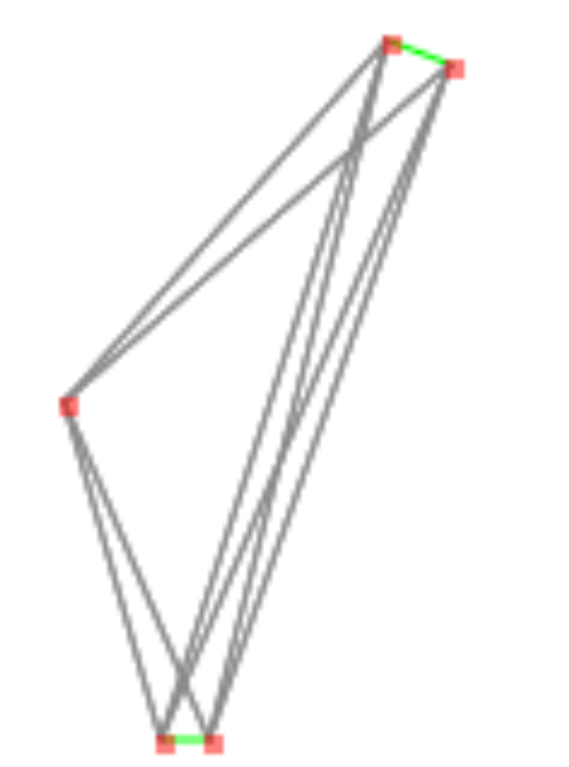

This could be cleaner, but it involves time and rethinking what has been done evolutionary.
Heuristics works as follows:
1) Keeping track of connected dots in dictionary (dotId: [arrayOfIds])
2) Keeping track of amount of vertices per dot (dotId: countOfVertices)
At every step we are selecting vertice with least distance from available vertices list.
We update connected dots dictionary
Available vertices is reduced to those, that are involving dots with less then 2 vertices and those that are involving disconnected dots.
